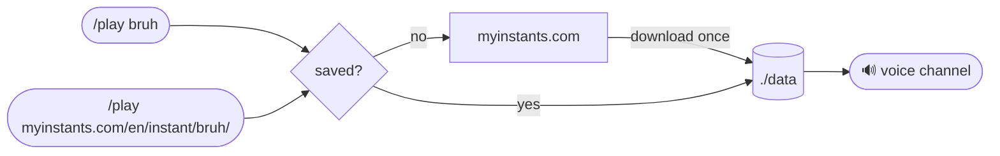

# MyInstants Discord Soundboard

Discord bot that plays sounds from [myinstants.com](https://www.myinstants.com) in voice channels.


## How it works



Sounds are saved per server, so the next play comes straight from disk — and so does every button on the soundboard.

## Commands

| Command | Description |
|---|---|
| `/play <sound>` | Play a sound by name or link. New sounds are saved to the server. |
| `/sounds` | Post the soundboard |
| `/delete` | Delete sounds |
| `/stop` | Stop and leave the voice channel |
| `/read <text> [voice]` | Read a text aloud ((up to 1000 characters)) |
| `/voice <voice>` | Choose the voice `/read` uses for you |

`/play` autocompletes as you type: saved sounds first, then MyInstants search results.

### Text to speech

`/read` speaks with Microsoft Edge's Spanish neural voices (45 of them, `Catalina` from Chile by default). The `voice` option is searchable by name or country: try `chile`, `mx`, `jorge`.

A read is never interrupted. Sounds played during a read wait for it to finish and then play in order, before the next read. Outside of a read, sounds interrupt each other as usual.

## Setup

```bash
cp .env.example .env   # add DISCORD_TOKEN and CLIENT_ID
mkdir -p data logs
docker compose up -d --build
```

Sounds are stored in `./data` (SQLite + audio files), logs in `./logs`.

Without Docker, you need Node 24+ and `ffmpeg`:

```bash
npm install && npm start
```

## Configuration

Set in `.env`, see [`.env.example`](.env.example) for the full list.

| Variable | Default | Description |
|---|---|---|
| `DISCORD_TOKEN` | | Bot token |
| `CLIENT_ID` | | Application ID |
| `GUILD_ID` | | Register commands to one server instantly instead of globally |
| `MAX_SOUNDS_PER_GUILD` | `1000` | Oldest sounds are removed past this limit. `0` = unlimited |
| `TTS_DEFAULT_VOICE` | `catalina` | Voice `/read` uses until a user picks one with `/voice` |
| `TTS_MAX_LENGTH` | `1000` | Longest text `/read` accepts, in characters |
| `LOG_LEVEL` | `info` | `debug` for verbose output |

## Notes

- MyInstants sits behind Cloudflare: requests use a Chrome TLS fingerprint ([impit](https://github.com/apify/impit)), with [FlareSolverr](https://github.com/FlareSolverr/FlareSolverr) as fallback for JavaScript challenges
- The bot leaves the voice channel after 15 minutes of inactivity
- Edge text to speech uses an unofficial endpoint ([msedge-tts](https://github.com/Migushthe2nd/MsEdgeTTS)), so it can break without notice
- Activity is logged to `logs/soundboard-YYYY-MM-DD.log`, kept 7 days
